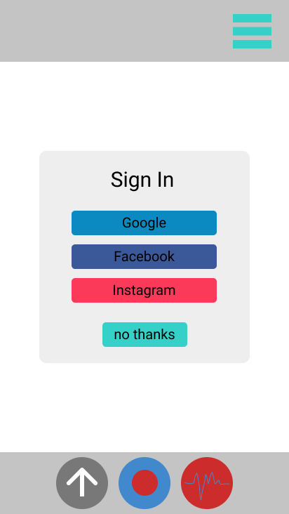
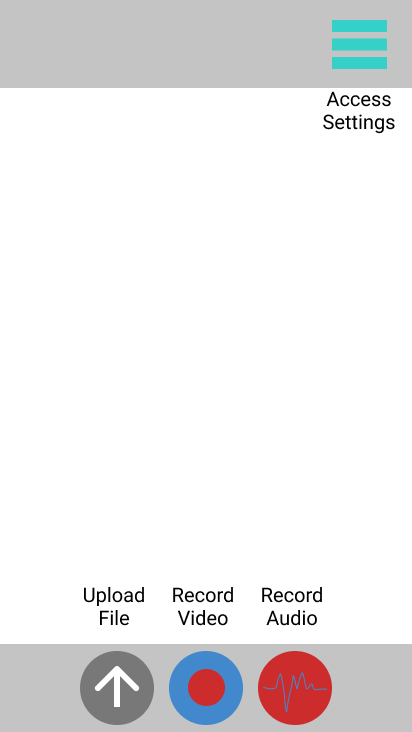
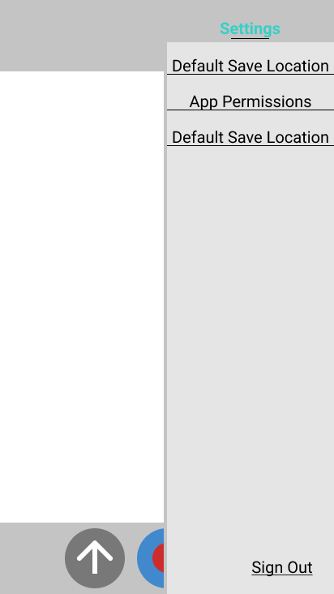

# User Guide

## Overview
Fact Check is the fastest way to find if those pesky news outlets are telling the truth! We scan over millions of trusted articles to find the truth for you! You no longer have any need to check for yourself! 

This app also works great to put your stupid friends in their place!

## Sign In
**To use are app, you will need to connect _all_ of listed social media accounts.** (if you don't have one, make one) We need to figure out how to get you the right facts after all. Simply follow the prompts and agree to everything you see!

To know what we do with your data please take a look at our [User Information Privacy Statement](privacy.md)

## Basic Controls

* Middle button records video to upload and fact check, Premium users can use video stream which overlays the facts over the fallacies
* Left button allows user to upload documents, videos, and photos for fact checking
* Right button records video to upload and fact check, Premium users can use audio stream which turns the screen green when the truth is being spoken, red if it is false
* The top right buttons allows you to access the settings where you can change *some* of the behavior of the app. (see blow for more)

## Settings Panel

* **Default Save Location:** change where recorded files are saved 
* **App permissions:** add permissions for the app to do cooler things. Premium users must give Admin permissions to app for their paid for features 

!!!info
    users are _unable to deny_ app permissions after they are given

## Error Codes

Errors happen! if you see something similar to this on your screen here is an ordered list of what you can do!

1. try to restart the app
2. look online at our FAQ
3. Call our tech support at **1-800-WHAT-IS-TRUTH** and describe your issue

# FAQ

* ### Q: How does the app know what is true? 
**A:** our state-of-the-art algorithms read the information of millions of articles, books, and files to find the most truthful information possible. By asking questions to your app, you are also contributing more to what is true!
* ### Q: I want to check more facts in more ways! 
**A:** Take a look at our Premium user package in the app store to get access to more features, like fact check history!
* ### Q: What are you doing with my information?
**A:** take a look at our [User Information Privacy Statement](privacy.md) for more info!
* ### Q: How do I update my app?
**A:** Don't worry about it! we automatically keep _you_ up to date with the latest of our features.

